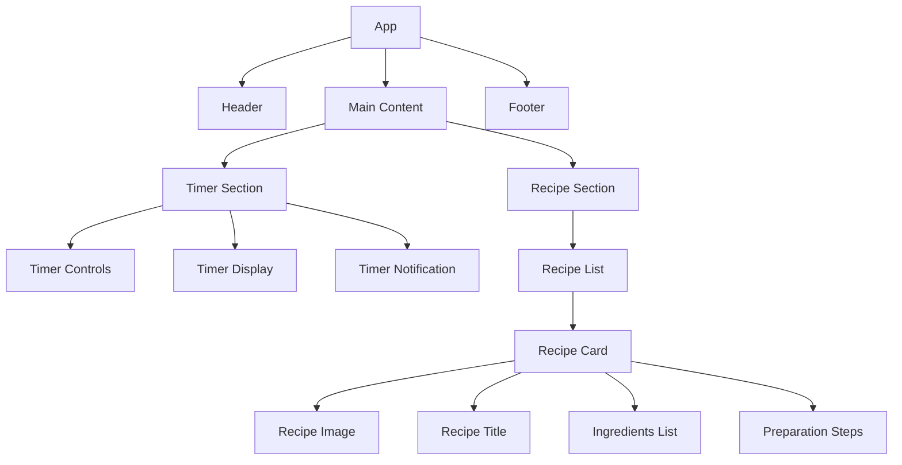
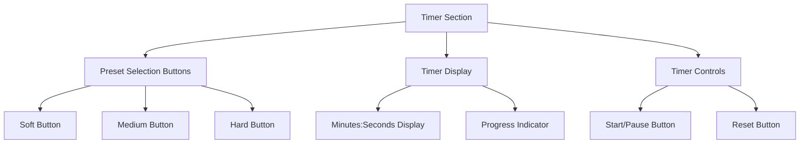
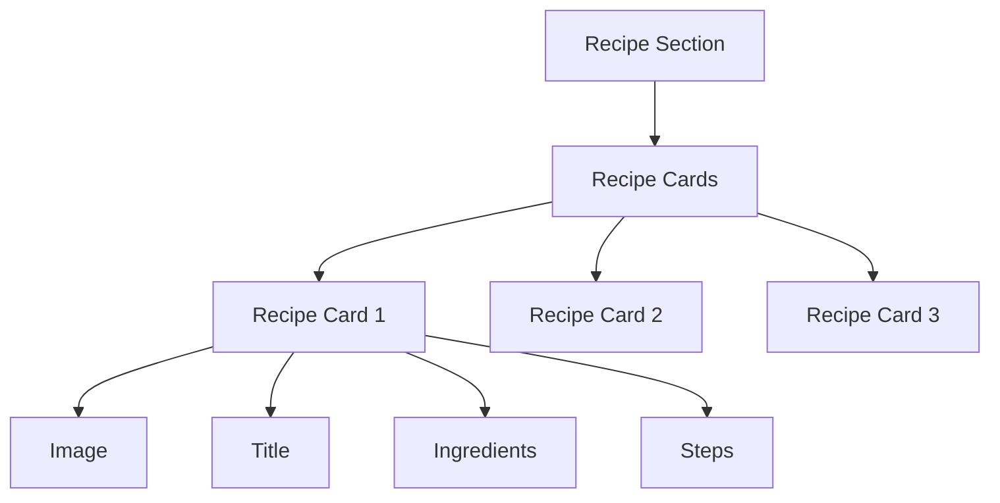

# Egg Website Project Specification

## Project Overview

This document outlines the specifications for a simple egg-themed website that provides two main features:
1. An interactive egg timer for cooking perfect soft, medium, and hard-boiled eggs
2. A collection of basic egg recipes presented in a simple card format

The website will be built using a modern JavaScript framework (React or Vue.js) to provide a responsive and interactive user experience, particularly for the timer functionality.

## User Stories/Requirements

### Egg Timer Feature
- Users can select from preset egg cooking options (soft, medium, hard-boiled)
- Users can start, pause, and reset the timer
- Users receive visual notifications when the timer completes
- Users receive audio notifications when the timer completes
- Timer displays a countdown in minutes and seconds

### Recipe Feature
- Users can view a collection of egg recipes
- Each recipe is displayed as a card with:
  - Recipe title
  - Recipe image
  - List of ingredients
  - Step-by-step preparation instructions
- Recipes have minimal styling for a clean presentation

## Technical Architecture

The website will be built using a modern JavaScript framework. We'll outline specifications for both React and Vue.js, and the final implementation can use either based on developer preference.

### Technology Stack

#### Option 1: React-based Implementation
- **Frontend Framework**: React
- **State Management**: React Context API or Redux (for more complex state)
- **Styling**: CSS Modules or styled-components
- **Build Tool**: Vite
- **Deployment**: Static site hosting (GitHub Pages, Netlify, or Vercel)

#### Option 2: Vue.js-based Implementation
- **Frontend Framework**: Vue.js
- **State Management**: Vuex or Pinia
- **Styling**: Scoped CSS or Tailwind CSS
- **Build Tool**: Vite
- **Deployment**: Static site hosting (GitHub Pages, Netlify, or Vercel)

## Component Structure



## Data Structure

### Timer Data

```javascript
// Timer presets
const timerPresets = [
  {
    id: 'soft',
    name: 'Soft-boiled',
    time: 4 * 60, // 4 minutes in seconds
    description: 'Runny yolk, soft white'
  },
  {
    id: 'medium',
    name: 'Medium-boiled',
    time: 6 * 60, // 6 minutes in seconds
    description: 'Jammy yolk, firm white'
  },
  {
    id: 'hard',
    name: 'Hard-boiled',
    time: 9 * 60, // 9 minutes in seconds
    description: 'Fully cooked yolk and white'
  }
];

// Timer state
const timerState = {
  selectedPreset: 'medium',
  timeRemaining: 6 * 60, // seconds
  isRunning: false,
  isComplete: false
};
```

### Recipe Data

```javascript
const recipes = [
  {
    id: 1,
    title: 'Classic Deviled Eggs',
    image: 'deviled-eggs.jpg',
    ingredients: [
      '6 large eggs',
      '1/4 cup mayonnaise',
      '1 tsp Dijon mustard',
      '1 tsp white vinegar',
      'Salt and pepper to taste',
      'Paprika for garnish'
    ],
    steps: [
      'Hard boil the eggs using the egg timer.',
      'Peel the eggs and cut them in half lengthwise.',
      'Remove the yolks and place them in a bowl.',
      'Mash the yolks and mix with mayonnaise, mustard, vinegar, salt, and pepper.',
      'Spoon or pipe the mixture back into the egg whites.',
      'Sprinkle with paprika before serving.'
    ]
  },
  // Additional recipes will be added here
];
```

## User Interface Design

### Layout

The website will have a simple, clean layout with:
- A header containing the website title and navigation (if needed)
- A main content area divided into two main sections:
  - Timer section (prominently displayed at the top)
  - Recipe section (scrollable list below the timer)
- A minimal footer with copyright information

### Timer UI



### Recipe UI



## Implementation Plan

### Phase 1: Project Setup
1. Initialize the project using Vite with either React or Vue.js
2. Set up the basic project structure
3. Configure build tools and dependencies
4. Create a basic layout with placeholder components

### Phase 2: Timer Implementation
1. Create timer UI components
2. Implement timer logic (start, pause, reset)
3. Add preset selection functionality
4. Implement visual notification for timer completion
5. Add audio notification for timer completion

### Phase 3: Recipe Implementation
1. Create recipe data structure
2. Implement recipe card component
3. Create recipe list component
4. Style recipe cards with minimal design

### Phase 4: Styling and Polish
1. Apply consistent styling across the application
2. Ensure responsive design for different screen sizes
3. Add transitions and animations for better user experience
4. Implement accessibility features

### Phase 5: Testing and Deployment
1. Test all functionality across different browsers
2. Fix any bugs or issues
3. Optimize for performance
4. Deploy to a static hosting service

## Future Enhancements (Optional)

While keeping the current scope simple, the following features could be considered for future enhancements:

1. Customizable timer settings (egg size, starting temperature)
2. Save favorite recipes functionality
3. Print recipe option
4. Share recipe via social media
5. Dark/light mode toggle
6. Add more egg recipes and categories
7. User-submitted recipes

## Conclusion

This project specification outlines a simple egg website with a timer feature and recipe collection. The implementation will use a modern JavaScript framework (React or Vue.js) to provide an interactive experience, particularly for the timer functionality. The design will be kept minimal with a focus on usability and functionality.
